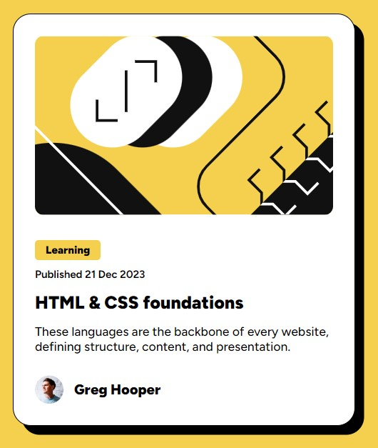

# Frontend Mentor - Blog preview card solution

This is a solution to the [Blog preview card challenge on Frontend Mentor](https://www.frontendmentor.io/challenges/blog-preview-card-ckPaj01IcS). 

## Table of contents

- [Overview](#overview)
  - [Screenshot](#screenshot)
  - [Links](#links)
- [My process](#my-process)
  - [Built with](#built-with)
  - [What I learned](#what-i-learned)
- [Author](#author)


## Overview

### Screenshot



### Links

- Solution URL: [Github](https://github.com/Muhammad-Taus/Front-End-Mentor-Blog-Preview-Card-)
- Live Site URL: [Add live site URL here](https://your-live-site-url.com)

### Built with

- Semantic HTML5 markup
- CSS custom properties
- Flexbox
- Mobile-first workflow
- Clamp function and rem units for responsiveness

### What I learned

I have prepared the design from scratch without viewing any similar code. I used the clamp function for the responsive width of the card and made the fonts responsive using rem units without using media queries.

```css
.card{
    width: clamp(327px, 70vw, 384px);
    background-color: var(--whiteColor);
    padding: 1.5rem;
    border-radius: 20px;
    box-shadow: 10px 10px;
}
```


## Author

- Muhammad Taus - [@Muhammad-Taus](https://www.frontendmentor.io/profile/Muhammad-Taus)